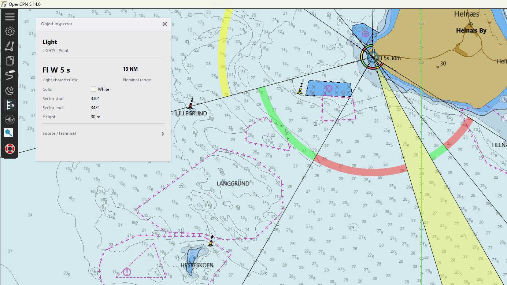
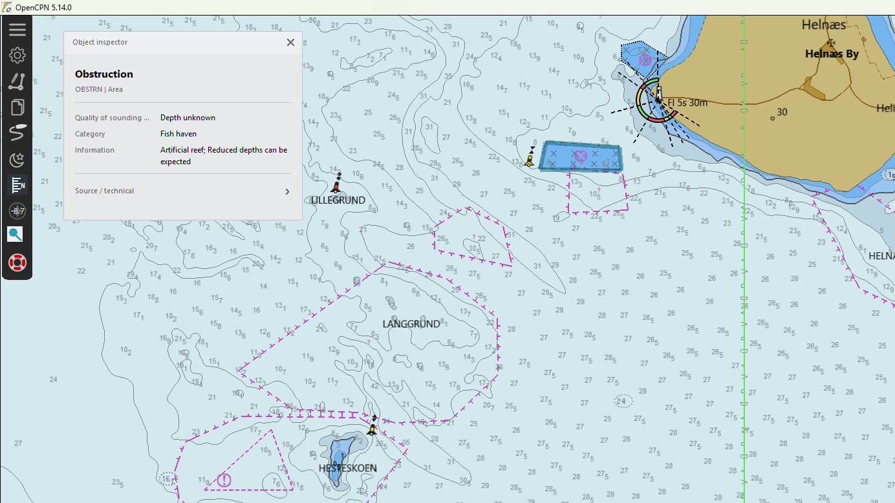

# Chart Inspector

Chart Inspector is an OpenCPN plugin for direct, readable inspection of vector chart objects.

Move the pointer over a chart feature and Chart Inspector highlights the selected object on the chart and shows the information which matters for navigation: object type, depth or clearance, category, colour, light characteristic, range, restrictions and other relevant attributes.

> **Status:** 0.4.0 development preview. The plugin is functional and currently being tested with vector charts and o-charts. It depends on an experimental read-only vector-object query extension which is being prepared as a generic OpenCPN API proposal.

## Preview

The current inspector uses a compact navigation-first presentation while leaving the chart visually primary.

<table>
<tr>
<td></td>
<td></td>
</tr>
<tr>
<td><em>Cardinal buoy: semantic topmark, colour pattern and compact technical disclosure.</em></td>
<td><em>Light: characteristic and nominal range receive the strongest visual priority.</em></td>
</tr>
</table>

▶ **[Watch the short Chart Inspector demo](https://youtu.be/ziPwUMbQ6nQ)**

## Why

Vector charts contain much more information than can be displayed at once. OpenCPN can expose these attributes through its existing object-query workflow, but identifying the exact feature under the pointer can be slower than necessary.

Chart Inspector is intended to answer a simple question quickly:

> **What is that on my chart?**

## Current features

- Live hover selection of vector chart features.
- Neutral blue/cyan interaction highlighting without changing official chart symbology.
- Full line and area boundary highlighting.
- Compact custom-drawn information panel for hover and persistent selection.
- Navigation-first presentation of S-57 attributes.
- Decoded object categories, colours, light information, depths and restrictions.
- Literal S-57 colour chips for aids to navigation.
- Associated light information for buoys and beacons where available.
- Cardinal topmark pictograms derived from the real `CATCAM` attribute.
- Object-class filtering in plugin preferences.
- Natural/background chart geometry is excluded from the default selectable profile.
- Collapsible source/technical section for S-57 class, geometry, SCAMIN and related metadata.
- Day/Dusk/Night-aware UI styling derived from OpenCPN.

## Interaction

1. Move the pointer over a selectable vector feature.
2. The most relevant object near the pointer is highlighted.
3. Chart Inspector shows a concise navigation-oriented description.
4. Clicking an object creates a persistent selection using the same inspector language.
5. Source and technical chart metadata remain subordinate and can be expanded when needed.

Examples of the intended information hierarchy:

```text
Wreck
16.1 m
Depth

Water level effect    Always under water/submerged
```

```text
Light
Fl W 5 s                         13 NM
Light characteristic             Nominal range

Color              White
Sector start       330°
Sector end         343°
Height             30 m
```

## Architecture

Chart Inspector remains a normal OpenCPN plugin. It does not parse proprietary chart files itself and does not modify chart portrayal.

```text
OpenCPN chart canvas
        |
        | pointer position
        v
Chart Inspector
        |
        | bounded, read-only vector object query
        v
OpenCPN chart abstraction
        |
        +-- native vector charts
        +-- plugin-provided vector charts
```

The proposed OpenCPN interface is intentionally generic. Chart Inspector is one reference use case; the same API could support contextual chart tools, route/object analysis, accessibility tools and other navigation plugins.

## Selection policy

The default profile focuses on visible physical, man-made and navigation-relevant objects such as buoys, beacons, lights, wrecks, landmarks, bridges and cables.

Background/natural chart geometry such as coastlines, depth areas and seabed polygons is not selected by default. Exact feature classes can be changed in Preferences.

OpenCPN portrayal controls remain authoritative. The plugin is not intended to resurrect objects explicitly hidden by the user's display settings. An optional scale-hidden inspection mode exists for selected navigation objects and is shown explicitly as an informational state when used.

## Maritime UI

Chart Inspector uses a restrained maritime HMI language designed with reference to IMO MSC.191(79), IMO MSC.1/Circ.1609, IEC 62288 and IHO S-52 presentation principles.

This is a design reference, not a statement of type approval or ECDIS compliance.

The main rules are:

- the chart remains the primary operational surface;
- OpenCPN DAY / DUSK / NIGHT remains authoritative;
- navigation-critical values receive the strongest hierarchy;
- red, amber/yellow and green are not generic interaction colours;
- literal chart colours remain literal;
- normal source/technical metadata is visually subordinate;
- hover and persistent selection remain distinct from safety alerts.

See [`docs/MARITIME_HMI.md`](docs/MARITIME_HMI.md) for the design rationale and real examples.

## Development principles

- Provider-independent wherever possible.
- Read-only access to chart features.
- Preserve official chart symbology.
- Keep pointer-hover queries bounded and fast.
- Prefer small generic OpenCPN API improvements over provider-specific workarounds.
- Present navigation information before technical metadata.
- Keep the OpenCPN core patch as small as possible and target the generic vector-query work for upstream inclusion.

## Building

The preview currently builds against OpenCPN plugin API 1.18 and wxWidgets. The experimental vector-object query host/provider changes are not yet part of upstream OpenCPN, so a matching development build is currently required.

## Roadmap

- [x] Canvas mouse interaction.
- [x] Vector-object hover highlighting.
- [x] Point, line and area geometry highlighting.
- [x] Compact navigation-first information window.
- [x] S-57 attribute decoding and colour chips.
- [x] Selectable feature-class preferences.
- [x] Shared maritime HMI foundation.
- [x] Unified compact inspector for hover and persistent selection.
- [ ] Reduce and submit the generic OpenCPN vector-object query API upstream.
- [ ] Submit matching provider support where required.
- [ ] Test on additional platforms and chart providers.
- [ ] Package the first public preview through the normal OpenCPN plugin distribution workflow.

## Contributing

Testing with different vector chart sources and platforms is especially useful. Reports about wrong object selection, incomplete geometry, missing navigation attributes or UI issues in Day/Dusk/Night modes are welcome.

## Development note

Parts of the implementation and documentation were developed with AI-assisted coding. All changes are reviewed, built and tested by the maintainer before being committed.

## License

GPL-2.0-or-later. See `LICENSE`.
