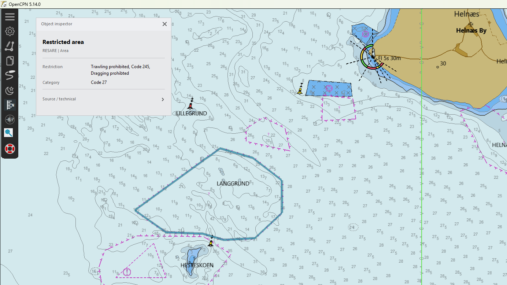
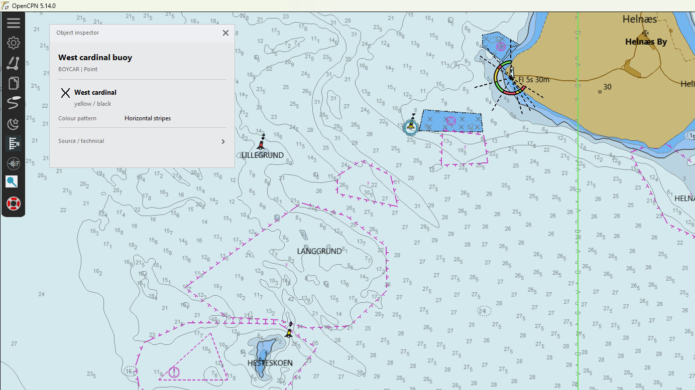

# Chart Inspector Maritime HMI

Chart Inspector uses a restrained maritime human-machine-interface design language for navigation-related information.

This is a design reference, not a statement of type approval or ECDIS compliance.

## Reference framework

The interaction and presentation rules are designed with reference to:

- IMO MSC.191(79), *Performance Standards for the Presentation of Navigation-related Information on Shipborne Navigational Displays*.
- IMO MSC.1/Circ.1609, *Guidelines for the Standardization of User Interface Design for Navigation Equipment*.
- IEC 62288, presentation of navigation-related information on shipborne navigational displays.
- IHO S-52 presentation principles for ENC portrayal.

Chart Inspector is an OpenCPN plugin and is not presented as IMO-, IEC- or ECDIS-approved equipment.

## Core rules

### 1. The chart remains primary

The inspector must not visually compete with the chart. Information panels use restrained contrast, limited decoration and clear grouping.

### 2. DAY / DUSK / NIGHT belong to the navigation system

Chart Inspector follows OpenCPN's active colour scheme. It does not introduce an independent desktop-style light/dark theme.

All new UI elements must be checked in:

- DAY
- DUSK
- NIGHT

Night presentation must avoid unnecessary luminous area and excessive contrast.

### 3. Safety colours are not generic UI colours

Red, amber/yellow and green are reserved for safety/status semantics and literal navigation information.

They must not be used merely to indicate:

- hover
- selection
- focus
- an enabled button
- ordinary success/failure of a non-safety interaction

Chart Inspector uses a restrained cool blue/cyan family for ordinary interaction focus.

Literal S-57/S-101 information is exempt. For example, a red or green light may and should be shown in its encoded signal colour.

### 4. Information has hierarchy

The intended order is:

1. object identity / object class
2. navigation-critical value, when present
3. operational attributes
4. source / integrity / technical information

Technical S-57 data is subordinate to human-readable navigation information and may be hidden unless requested.

### 5. Typography is functional

Use the system sans-serif font, normal style, clear weight hierarchy and no decorative italics. Numeric values and units should remain easy to scan.

### 6. Units are explicit

Never present a navigation value without its unit when the unit is meaningful. Use consistent notation such as:

- `12.4 m`
- `10 s`
- `11 NM`
- `045°`

### 7. Hover and selection are distinct from alerts

Object hover is a temporary interaction cue. It must not blink and must not resemble an alarm.

Persistent selection should be stronger than hover while remaining outside the alert colour vocabulary.

### 8. Animation is informational only

The light-characteristic preview is a schematic aid. The encoded chart attributes remain authoritative. Animation must never be used as a generic attention mechanism.

## Current interaction pattern

The compact inspector is intentionally narrow and uses the same presentation language for hover and persistent selection.

The panel header remains quiet. The first strong element is the object identity. When a navigation-critical value exists, it receives the largest type. Operational attributes follow in a simple label/value grid. Source and technical metadata stays behind a disclosure row.

For objects where the chart encoding contains a semantically useful visual cue, the inspector may draw a small explanatory pictogram. The cardinal topmark is an example: it is derived from `CATCAM`, but it is an inspector aid and is not presented as a replacement for the official S-52 chart symbol.

## Real examples

### Cardinal buoy

The cardinal direction is promoted from a generic attribute into the object identity. The topmark pictogram and encoded yellow/black colour pattern support recognition without competing with the chart portrayal.

### Sector light

The encoded light characteristic and nominal range are the hero values. Sector bearings, colour and height remain clearly secondary. Literal signal colours stay literal.

### Obstruction

Operational meaning is prioritised over raw S-57 acronyms: sounding quality, obstruction category and explanatory information can be scanned without exposing implementation detail.

### Isolated danger buoy

When no single numeric value dominates, the inspector remains compact and presents the encoded colour/pattern information without inventing unnecessary hierarchy.

### Restricted area

Long operational restrictions are allowed to wrap rather than being truncated. Unknown enumeration values are shown explicitly as codes instead of being silently interpreted.

## Palette ownership

`src/ui/app_style.*` is the single source of truth for Chart Inspector UI palette and typography.

Do not introduce hard-coded red/yellow/green interaction states in new UI code. If a new semantic state is required, define it centrally and document the meaning here.

## Design intent

The goal is not to imitate the appearance of one commercial ECDIS. The goal is to inherit the useful bridge-HMI principles: predictable hierarchy, restrained colour, strong legibility, consistent units and minimum distraction.
